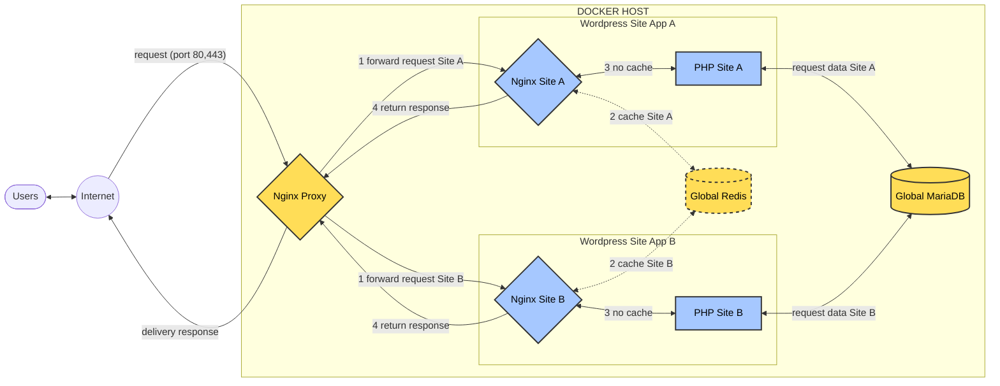
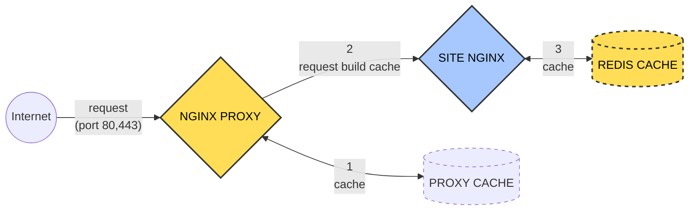

EasyEngine made a smart choice by only using Redis cache technology. This decision helps reduce the effort required to manage other caching options that are not significantly different while continuously improving their caching capabilities.

When using EasyEngine, you don’t need any additional caching technology or plugins. It is already sufficient—keep your website simple.

## Fullpages Cache Redis

Fullpages cache is the most powerful technology, storing your website entirely as HTML in RAM, managed by Redis. If the URL is enabled, retrieval does not require PHP or MariaDB.



## Object Cache Redis

Dynamic pages are excluded from fullpages cache, and in this case, object cache takes over. Instead of querying the database, objects are pre-stored in RAM and retrieved much faster. This is useful for dynamic pages and admin areas.

## Enabling Redis Cache

By using the `--cache` flag when creating a website, both fullpages cache and object cache are installed and configured automatically for WordPress.

```bash
ee site create example.com --cache
```

It is set up during site creation and does not have a built-in command for enabling or disabling it on an existing website.

Two plugins are pre-installed when `--cache` is enabled to support this functionality:

1. **nginx-helper**: Allows you to enable/disable and clear cache per page or globally within the admin panel. It also configures automatic cache clearing upon updates.
2. **object-cache.php**: Installed as an MU-plugin, it handles object caching without requiring any user interaction. It does not have an admin panel interface.

## Using Redis-CLI

Access the Global Redis container to execute Redis CLI commands.

```bash
# Enter the global Redis container
cd /opt/easyengine/services && docker-compose exec global-redis bash

# Execute Redis CLI commands,
# Example: View keys for sample.com
redis-cli KEYS "sample.com_page:*"
```

## Proxy Cache

On high-traffic websites, when cache expires, multiple concurrent requests may be sent to PHP to regenerate the same page. This can lead to overload and resource exhaustion.

To prevent this, the "proxy cache" mechanism allows NGINX-PROXY to serve an expired cached version while sending only one request to PHP to refresh the cache.

By default, proxy cache duration is 1 second before it expires but is not deleted. When cache expires, the Nginx-Proxy container continues serving the old cache while only one request is forwarded to the Nginx site.



Check whether cache is available:

1. **If available** → Serve from cache.
2. **If expired** → Serve the old cache while forwarding a request to Nginx.
3. **If not available** → Forward the request to the Nginx site.

Enable proxy cache:

```bash
ee site update example.com --proxy-cache=on
```

Reference: [Proxy cache as stale on Nginx-Proxy in EasyEngine v4](https://easyengine.io/handbook/proxy-cache-as-stale-on-nginx-proxy-in-easyengine-v4/)
