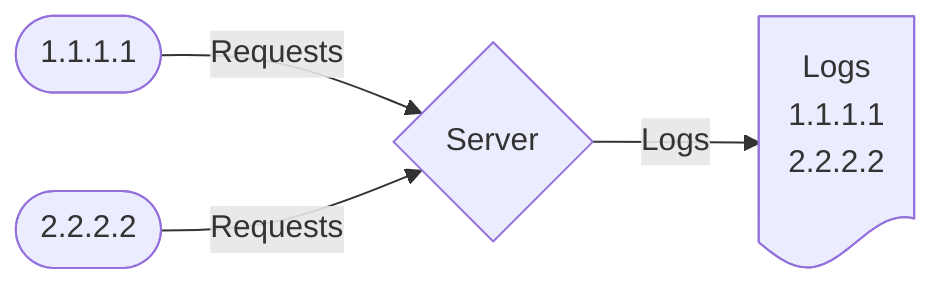
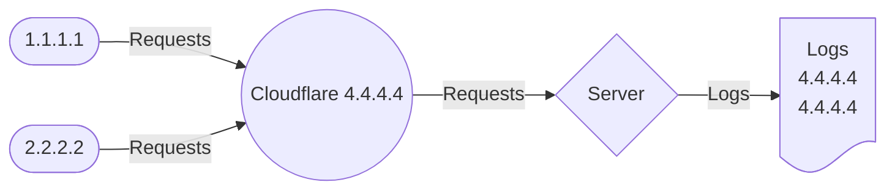
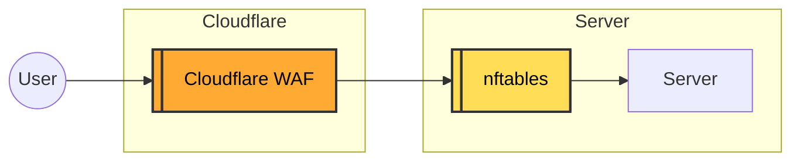
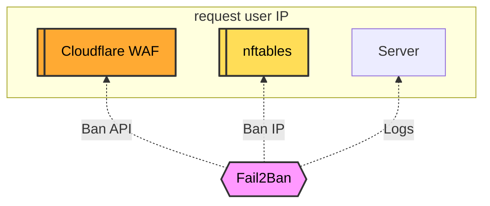

Currently, **Cloudflare is one of the most popular proxy services in the world**, used by millions of websites, ranging from personal blogs to large enterprises. With the capability to handle billions of requests daily, Cloudflare plays a crucial role in securing and optimizing the global internet infrastructure. Many of you are likely using it as well.  

If you use Cloudflare for websites hosted on an EasyEngine server, you hardly need to configure anything, as EasyEngine already comes with a system prepared for Cloudflare activation.  

## What Does Cloudflare Do?  

**Cloudflare** is a **reverse proxy platform** that helps **accelerate, secure, and optimize** websites by acting as an intermediary between users and the origin server. Once Cloudflare is enabled, all traffic passes through its system before reaching the server, offering several benefits:  

- **Website Acceleration**: Cloudflare functions as a **Content Delivery Network (CDN)**, caching static content on its global server network to reduce latency and improve loading speed.  
- **Enhanced Security**: Provides a Web Application Firewall (WAF), DDoS protection, bot filtering, and masks the origin server's IP address.  
- **Free SSL Support**: Offers free SSL certificates, encrypting traffic between users and Cloudflare. It supports multiple SSL modes (Flexible, Full, Full Strict) to ensure security.  
- **Reliability & Redundancy**: If the origin server goes down, Cloudflare can serve cached content, keeping the website accessible.  
- **Reduced Server Load**: Through caching and optimization mechanisms, Cloudflare reduces the number of requests reaching the origin server, saving resources.  

## Cloudflare SSL  

To use Cloudflare SSL with EasyEngine, follow these steps:  

1. Set up SSL on EasyEngine as usual to secure the connection between the server and Cloudflare:  

    ```bash
    ee site update sample.com --ssl=le
    ```

2. Configure SSL on Cloudflare:  
    - Go to **SSL/TLS** → **Overview**.  
    - Select **Full (Strict)** mode to enable end-to-end encryption with a valid certificate on the server (Let's Encrypt or another CA).  

## Nginx Logs Issue When Running Cloudflare  

When a website runs behind Cloudflare’s proxy, the server logs will not capture visitors' original IPs but instead show Cloudflare’s IPs. This happens because Cloudflare acts as an intermediary (proxy) between users and the web server.  

### Normal Server Logs (Without Cloudflare)  



### Server Logs with Cloudflare  



Without restoring the original IP, server logs will only display Cloudflare’s IPs, making tracking and security difficult. Anti-DDoS systems or IP-based restrictions may not function properly.  

## Cloudflare and Fail2Ban  

If you're using Cloudflare for all websites on an EasyEngine server, you may not need Fail2Ban, as Cloudflare’s WAF combined with EasyEngine’s built-in settings is usually sufficient. However, if you have a specific reason to use Fail2Ban alongside Cloudflare, some adjustments are required.  

### Restoring Original IP in Server Logs  

EasyEngine handles this by ensuring that **proxy logs** still capture the correct user IPs. However, EasyEngine maintains two types of logs:  

- **Proxy logs** correctly record user IPs.  
- **Site logs** may still show Cloudflare’s IPs instead of real user IPs, as Cloudflare is acting as a proxy.  

To display real IPs in **site logs**, modify the Nginx configuration:  

```bash
nano /opt/easyengine/sites/sample.com/config/nginx/nginx.conf
```

Locate the `Proxy Settings` section and change `real_ip_header X-Forwarded-For;` to `real_ip_header CF-Connecting-IP;`:  

```bash
    # Proxy Settings
    set_real_ip_from      0.0.0.0/0;
    real_ip_header  CF-Connecting-IP;
    client_max_body_size 100m;
```

Then, reload the Nginx site:  

```bash
ee site reload sample.com
```

Now, **both proxy logs and site logs will correctly reflect the real IP of visitors**, allowing Fail2Ban to function properly.  

### Setting Up Fail2Ban to Interact with Cloudflare WAF  

Cloudflare WAF is the first line of defense in your firewall setup, protecting your server before traffic reaches **nftables** (assuming you're using Debian 12).  

#### **Cloudflare WAF (Web Application Firewall)**  
Cloudflare WAF protects websites from attacks such as SQL injection, XSS, DDoS, and malicious bots. It acts as an intermediary proxy between users and the server, analyzing traffic to block malicious requests before they reach the origin server.  

#### **Advantages of Cloudflare WAF:**  
- **Automatic Protection:** Regular updates with the latest security rules.  
- **High Performance:** Runs on Cloudflare's global network, reducing server load.  
- **Easy Integration:** No hardware required, activation with just a few clicks.  

Cloudflare WAF is widely used for its strong protection, ease of use, and website performance optimization.  



### **How Fail2Ban Works with Cloudflare**  

Fail2Ban monitors server logs for suspicious activity and takes appropriate action to block threats. However, when using Cloudflare, Fail2Ban cannot directly block IPs at the server firewall level, since all traffic passes through Cloudflare.  

Instead, Fail2Ban can:  

1. **Block via Cloudflare API:** Send ban requests to Cloudflare WAF to block malicious IPs before they reach the server.  
2. **Block via nftables:** In some cases, if the real IP is available in the logs, Fail2Ban can still apply system-level bans.  
3. **Monitor logs:** Analyze logs to identify violators and take action accordingly.  

This approach improves security, reduces server load, and mitigates threats early.  



## **Adding Fail2Ban Actions for Cloudflare WAF**  

To integrate Fail2Ban with Cloudflare WAF, you need to modify Fail2Ban’s default actions to interact with Cloudflare’s API.  

### **1. Modify Fail2Ban Jail Configuration**  
Edit the **jail.local** configuration file:  

```bash
nano ~/fail2ban/data/jail.d/jail.local
```  

Add the following under `[DEFAULT]`:  

```ini
[DEFAULT]
...

action   = iptables-multiport[port="%(port)s", protocol="%(protocol)s", chain="%(chain)s"]
           cloudflare-token
```  

### **2. Create a Cloudflare Action File**  
Create a new action file **cloudflare-token.conf**:  

```bash
nano ~/fail2ban/data/action.d/cloudflare-token.conf
```  

Copy and paste the following configuration (replace `cfzone` and `cftoken` with your Cloudflare details):  

```ini
[Definition]

actionban = curl -s -X POST "<_cf_api_url>" \
              <_cf_api_prms> \
              --data '{"mode":"<cfmode>","configuration":{"target":"<cftarget>","value":"<ip>"},"notes":"<notes>"}'

actionunban = id=$(curl -s -X GET "<_cf_api_url>" \
              --data-urlencode "mode=<cfmode>" --data-urlencode "notes=<notes>" --data-urlencode "configuration.target=<cftarget>" --data-urlencode "configuration.value=<ip>" \
              <_cf_api_prms> \
                  | awk -F"[,:}]" '{for(i=1;i<=NF;i++){if($i~/'id'\042/){print $(i+1)}}}' \
                  | tr -d ' "' \
                  | head -n 1)
              if [ -z "$id" ]; then echo "<name>: ID for <ip> cannot be found using target <cftarget>"; exit 0; fi; \
              curl -s -X DELETE "<_cf_api_url>/$id" \
                  <_cf_api_prms> \
                  --data '{"cascade": "none"}'

_cf_api_url = https://api.cloudflare.com/client/v4/zones/<cfzone>/firewall/access_rules/rules
_cf_api_prms = -H "Authorization: Bearer <cftoken>" -H "Content-Type: application/json"

[Init]

cfzone = [your Cloudflare Zone ID]
cftoken = [your Cloudflare API Token]
cftarget = ip
cfmode = block
notes = Fail2Ban <name>
```  

### **3. Restart Fail2Ban**  
Reload Fail2Ban to apply the new configuration:  

```bash
docker-compose exec fail2ban fail2ban-client reload
```  

With this setup, Fail2Ban can now send ban requests directly to Cloudflare, improving security by blocking malicious IPs at the Cloudflare level before they reach your server.