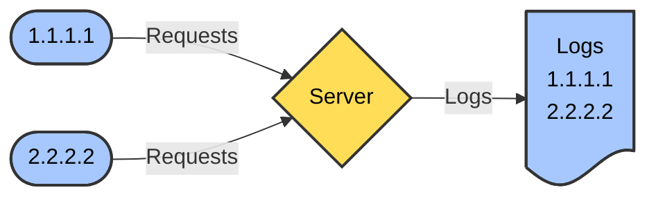
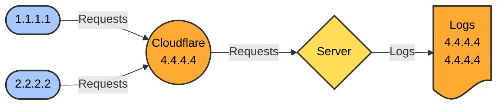
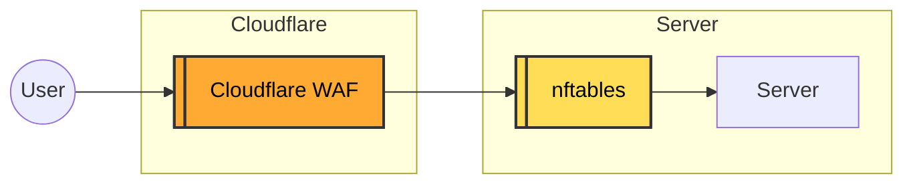
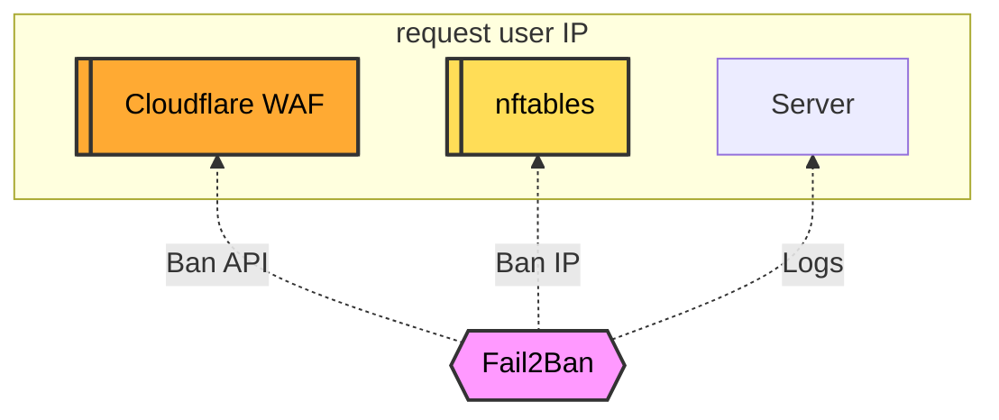

Hiện tại, Cloudflare là một trong những **dịch vụ proxy phổ biến nhất thế giới**, được sử dụng bởi hàng triệu website, từ các blog cá nhân đến doanh nghiệp lớn. Với khả năng xử lý hàng tỷ yêu cầu mỗi ngày, Cloudflare đóng vai trò quan trọng trong việc bảo vệ và tối ưu hóa hạ tầng internet toàn cầu. Và rất nhiều trong số các bạn cũng không ngoại lệ.

Nếu bạn sử dụng Cloudflare cho các website trên server EasyEngine, gần như bạn không cần làm gì nhiều, vì EasyEngine đã chuẩn bị một hệ thống sẵn sàng cho việc kích hoạt Cloudflare.

## Cloudflare làm được gì?

**Cloudflare** là một nền tảng **proxy ngược (reverse proxy)**, giúp **tăng tốc, bảo mật và tối ưu hóa** website bằng cách đứng giữa người dùng và máy chủ gốc. Khi kích hoạt Cloudflare, toàn bộ lưu lượng truy cập sẽ đi qua hệ thống Cloudflare trước khi đến máy chủ, mang lại nhiều lợi ích:

- **Tăng tốc website**: Cloudflare hoạt động như một **CDN (Content Delivery Network)**, lưu trữ nội dung tĩnh trên mạng lưới máy chủ toàn cầu, giúp giảm độ trễ và tải nhanh hơn.
- **Bảo mật nâng cao**: Với tường lửa ứng dụng web (WAF), chống tấn công DDoS, chặn bot xấu và ẩn địa chỉ IP máy chủ gốc.
- **Hỗ trợ SSL miễn phí**: Cung cấp chứng chỉ SSL miễn phí, giúp mã hóa dữ liệu giữa người dùng và Cloudflare, đồng thời hỗ trợ nhiều chế độ SSL (Flexible, Full, Full Strict) để đảm bảo tính bảo mật.
- **Ổn định và dự phòng**: Nếu máy chủ gốc gặp sự cố, Cloudflare có thể phân phát nội dung từ bộ nhớ đệm (cache), giúp website duy trì hoạt động.
- **Giảm tải cho máy chủ**: Nhờ cơ chế cache và tối ưu hóa, Cloudflare giúp giảm số lượng yêu cầu đến máy chủ gốc, tiết kiệm tài nguyên.

## Cloudflare SSL

Khi muốn sử dụng SSL Cloudflare với EasyEngine, bạn thực hiện các bước sau:

1. Thiết lập SSL với EasyEngine như bình thường, để bảo vệ kết nối giữa máy chủ và Cloudflare:

    ```bash
    ee site update sample.com --ssl=le
    ```

2. Cài đặt SSL trên Cloudflare:
    - Vào **SSL/TLS** → **Overview**.
    - Chọn chế độ **Full (Strict)**: Mã hóa hoàn toàn với chứng chỉ hợp lệ trên server (Let's Encrypt hoặc CA khác).

## Vấn đề của logs Nginx khi chạy với Cloudflare

Khi website chạy qua Cloudflare proxy, địa chỉ IP trong log máy chủ sẽ không phải IP gốc của khách truy cập mà là IP của Cloudflare. Điều này xảy ra vì Cloudflare đóng vai trò trung gian (proxy) giữa người dùng và máy chủ web.

Với máy chủ bình thường không chạy qua Cloudflare:



Với máy chủ chạy qua Cloudflare:



Nếu không khôi phục IP gốc, log server chỉ hiển thị IP của Cloudflare, gây khó khăn trong việc tracking & bảo mật. Các hệ thống chống DDoS hoặc giới hạn IP có thể không hoạt động chính xác.

## Cloudflare và Fail2Ban

Nếu bạn sử dụng Cloudflare cho toàn bộ các website trên EasyEngine server, có lẽ bạn rất ít lý do cần đến Fail2Ban, bởi hệ thống Cloudflare WAF kết hợp với các thiết lập sẵn có trên EasyEngine là đủ. Nhưng nếu có lý do đặc biệt cần sử dụng Fail2Ban chung với Cloudflare, bạn cần có những thiết lập thích ứng.

### Khôi phục IP gốc trong log server

EasyEngine đã xử lý sẵn, nên nginx-proxy logs file vẫn ghi nhận đúng IP thật của người dùng. Tuy nhiên, EasyEngine có hai loại logs: **Proxy logs** và **Site logs**. 

- **Proxy logs** ghi nhận đúng IP người dùng.  
- **Site logs** hiển thị IP của Cloudflare thay vì IP thực, vì Cloudflare đang đóng vai trò proxy.

Để lấy IP thực cho **site logs**, cần chỉnh sửa file cấu hình Nginx:

```bash
nano /opt/easyengine/sites/sample.com/config/nginx/nginx.conf
```

Tìm phần `Proxy Settings`, thay đổi dòng `real_ip_header X-Forwarded-For;` thành `real_ip_header CF-Connecting-IP;`:

```bash
    # Proxy Settings
    set_real_ip_from      0.0.0.0/0;
    real_ip_header  CF-Connecting-IP;
    client_max_body_size 100m;
```

Sau đó, khởi động lại Nginx site:

```bash
ee site reload sample.com
```

Lúc này, **cả Proxy logs và Site logs đều phản ánh đúng IP thật của người truy cập**, sẵn sàng cho Fail2Ban hoạt động chính xác.


### Thiết lập Fail2Ban can thiệp vào Cloudflare WAF  

Cloudflare WAF đứng trước tiên trong hàng rào tường lửa và bảo vệ server của bạn, sau đó đến nftables (giả định bạn dùng Debian 12).  

**Cloudflare WAF (Web Application Firewall)** là tường lửa ứng dụng web giúp bảo vệ website khỏi các cuộc tấn công như SQL injection, XSS, DDoS và bot độc hại. Nó hoạt động như một proxy trung gian giữa người dùng và máy chủ, phân tích lưu lượng truy cập để ngăn chặn các yêu cầu độc hại trước khi chúng đến server gốc.  

**Ưu điểm của Cloudflare WAF:**  

- **Bảo vệ tự động**: Cập nhật liên tục với các quy tắc bảo mật mới nhất.  
- **Hiệu suất cao**: Chạy trên mạng lưới Cloudflare toàn cầu, giảm tải cho máy chủ.  
- **Tích hợp dễ dàng**: Không cần phần cứng, có thể kích hoạt chỉ với vài cú nhấp chuột.  

Cloudflare WAF phổ biến vì khả năng bảo vệ mạnh mẽ, dễ sử dụng và giúp tối ưu hiệu suất website.  



Fail2Ban hoạt động bằng cách giám sát log server để phát hiện các hành vi đáng ngờ, sau đó thực hiện biện pháp chặn phù hợp. Khi hệ thống sử dụng Cloudflare, Fail2Ban không thể trực tiếp chặn IP trên firewall máy chủ do tất cả lưu lượng đều đi qua Cloudflare.  

Thay vào đó, Fail2Ban có thể:  

1. **Chặn qua API Cloudflare**: Gửi lệnh cấm IP trực tiếp lên Cloudflare WAF, ngăn chặn truy cập từ nguồn độc hại trước khi đến server.  
2. **Chặn qua nftables**: Trong một số trường hợp, nếu nhận diện được IP thực trong log, Fail2Ban vẫn có thể áp dụng lệnh chặn ở mức hệ thống.  
3. **Giám sát log**: Đọc log từ server để phát hiện IP vi phạm, giúp đưa ra quyết định chặn hiệu quả hơn.  

Cách tiếp cận này giúp bảo vệ hệ thống tốt hơn, giảm tải cho máy chủ và ngăn chặn các mối đe dọa từ sớm.  



## Thêm Action cho Fail2Ban  

Cần thêm Action cho Fail2Ban để nó can thiệp vào Cloudflare WAF.  

Thay đổi action mặc định của Fail2Ban, bổ sung thêm hành động tác động đến Cloudflare WAF.  

```bash
nano ~/fail2ban/data/jail.d/jail.local
```  

Thêm đoạn này vào khu vực `[DEFAULT]`:  

```bash
[DEFAULT]
...

action   = iptables-multiport[port="%(port)s", protocol="%(protocol)s", chain="%(chain)s"]
           cloudflare-token
```  

Thêm action `cloudflare-token.conf`:  

```bash
nano ~/fail2ban/data/action.d/cloudflare-token.conf
```  

Chép nội dung này vào, nhớ thay thế `cfzone` và `cftoken` của bạn vào file:  

```bash
#
# Author: Logic-32
#
# IMPORTANT
#
# Please set jail.local's permission to 640 because it contains your CF API token.
#
# This action depends on curl.
#
# To get your Cloudflare API token: https://developers.cloudflare.com/api/tokens/create/
#
# Cloudflare Firewall API: https://developers.cloudflare.com/firewall/api/cf-firewall-rules/endpoints/

[Definition]

# Option:  actionstart
# Notes.:  Command executed on demand at the first ban (or at the start of Fail2Ban if actionstart_on_demand is set to false).
# Values:  CMD
#
actionstart =

# Option:  actionstop
# Notes.:  Command executed at the stop of jail (or at the end of Fail2Ban).
# Values:  CMD
#
actionstop =

# Option:  actioncheck
# Notes.:  Command executed once before each actionban command.
# Values:  CMD
#
actioncheck =

# Option:  actionban
# Notes.:  Command executed when banning an IP.
# Tags:    <ip>  IP address
#          <failures>  Number of failures
#          <time>  Unix timestamp of the ban time
# Values:  CMD
actionban = curl -s -X POST "<_cf_api_url>" \
              <_cf_api_prms> \
              --data '{"mode":"<cfmode>","configuration":{"target":"<cftarget>","value":"<ip>"},"notes":"<notes>"}'

# Option:  actionunban
# Notes.:  Command executed when unbanning an IP.
# Tags:    <ip>  IP address
#          <failures>  Number of failures
#          <time>  Unix timestamp of the ban time
# Values:  CMD
#
actionunban = id=$(curl -s -X GET "<_cf_api_url>" \
              --data-urlencode "mode=<cfmode>" --data-urlencode "notes=<notes>" --data-urlencode "configuration.target=<cftarget>" --data-urlencode "configuration.value=<ip>" \
              <_cf_api_prms> \
                  | awk -F"[,:}]" '{for(i=1;i<=NF;i++){if($i~/'id'\042/){print $(i+1)}}}' \
                  | tr -d ' "' \
                  | head -n 1)
              if [ -z "$id" ]; then echo "<name>: ID for <ip> cannot be found using target <cftarget>"; exit 0; fi; \
              curl -s -X DELETE "<_cf_api_url>/$id" \
                  <_cf_api_prms> \
                  --data '{"cascade": "none"}'

_cf_api_url = https://api.cloudflare.com/client/v4/zones/<cfzone>/firewall/access_rules/rules
_cf_api_prms = -H "Authorization: Bearer <cftoken>" -H "Content-Type: application/json"

[Init]

# Declare your Cloudflare Authorization Bearer Token in the [DEFAULT] section of your jail.local file.

# The Cloudflare <ZONE_ID> of the domain you want to manage.
#
cfzone = [điền cfzone của bạn]

# Your personal Cloudflare token. Ideally restricted to just have "Zone.Firewall Services" permissions.
#
cftoken = [điền cftoken của bạn]

# Target of the firewall rule. Default is "ip" (v4).
#
cftarget = ip

# The firewall mode Cloudflare should use. Default is "block" (deny access).
# Consider also "js_challenge" or other "allowed_modes" if you want.
#
cfmode = block

# The message to include in the firewall IP banning rule.
#
notes = Fail2Ban <name>

[Init?family=inet6]
cftarget = ip6
```  

Reload Fail2Ban sau khi chỉnh sửa các thiết lập:  

```bash
docker-compose exec fail2ban fail2ban-client reload
```  
