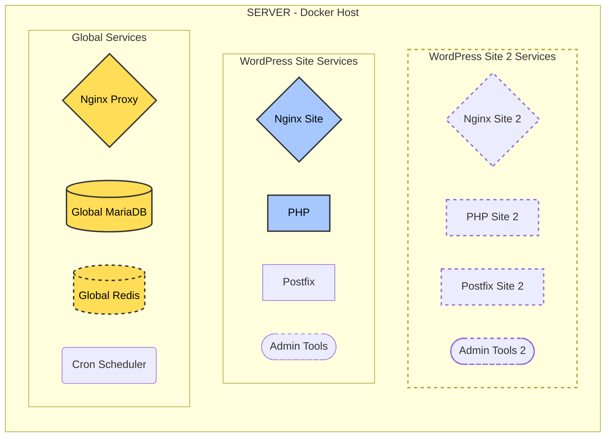
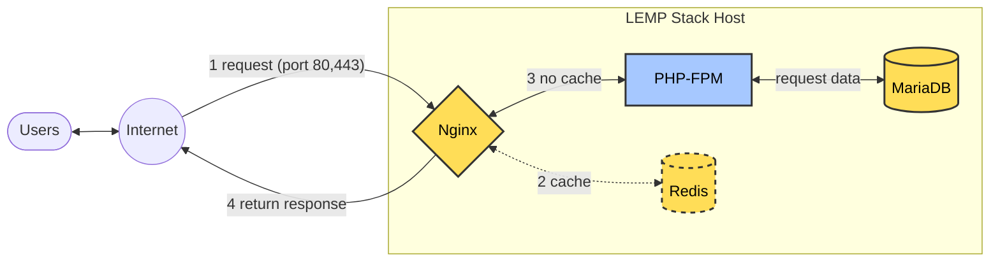
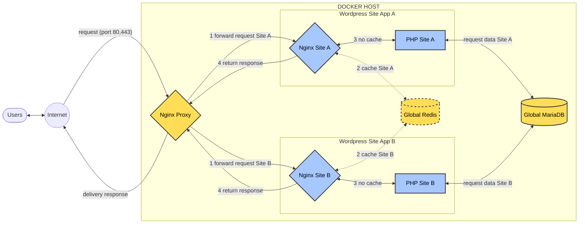

If you're not familiar with Docker, no worries—EasyEngine 4 handles everything for you. You just need to use it with a few considerations about the differences and how you intervene compared to a traditional LEMP stack. However, taking some time to understand basic Docker concepts will be immensely helpful when operating EasyEngine. It will also make your work more interesting.

## Essential Docker Concepts

Below is a comparison table for easier understanding:

| **Criteria** | **Traditional LEMP** | **Dockerized LEMP** |
| --- | --- | --- |
| **Software Installation** | Installed via apt/yum, e.g., `apt install nginx` | Uses images, e.g., `docker pull nginx` |
| **Configuration** | Edits files on host, e.g., `/etc/nginx` | Uses environment variables and configuration files in volumes |
| **Service Management** | Uses systemctl, e.g., `systemctl start nginx` | Uses Docker commands, e.g., `docker start nginx-container` |
| **Data Storage** | Stored on the host, e.g., `/var/lib/mysql` | Uses volumes, e.g., `-v mysql-data:/var/lib/mysql` |
| **Service Communication** | Via localhost (127.0.0.1) | Via Docker network, requires configuration |
| **Updates** | Upgrades packages on the host | Pulls new images and recreates containers |
| **Security** | Manages permissions on the host | Isolates containers, manages container permissions |

**Images**
- Instead of installing software directly on the host, you use Docker images, such as [nginx](https://hub.docker.com/_/nginx), [mysql](https://hub.docker.com/_/mysql), and [php](https://hub.docker.com/_/php). These images contain the code, libraries, and configurations needed to run the service.
- You can build custom images via Dockerfile if necessary, such as adding PHP modules or special NGINX configurations.

**Containers**
- A container is a running instance of an image, each isolated and running a single service (NGINX, MySQL, PHP).
- Unlike programs running directly on the host, containers have their own file systems and do not directly affect the host, making isolation and debugging easier.

**Docker Compose**
- A tool for defining and managing multiple containers, replacing individual `docker run` commands.
- For example, a `docker-compose.yml` file defines NGINX, PHP-FPM, MySQL, networks, and volumes, allowing the entire stack to be started with `docker-compose up`.
- Compared to a traditional LEMP setup, this is like managing the entire stack through one file instead of configuring each service separately.

**Volumes**
- Instead of storing data in host directories like `/var/lib/mysql`, you use volumes for persistent storage.
- Example: Attaching a volume for MySQL: `-v mysql-data:/var/lib/mysql`, ensuring data is not lost if the container is removed.
- This is crucial for databases and web files, different from storing them directly on the host.

**Networks**
- In a traditional LEMP stack, services communicate via localhost (127.0.0.1). In Docker, you must create a network, e.g., `docker network create lemp-net`, and attach containers to it for communication.
- Example: NGINX must connect to PHP-FPM via the network, using TCP (port mapping or network alias) instead of Unix sockets.

**Port Mapping**
- To access services externally, you map host ports to container ports, e.g., `-p 80:80` for NGINX.
- Unlike traditional LEMP, where ports are directly bound on the host, this is a necessary step for container access.

**Environment Variables**
- Instead of editing configuration files on the host, you configure services via environment variables, e.g., `MYSQL_ROOT_PASSWORD` for MySQL.
- This enhances flexibility, especially when deploying across different environments (development, production).

**Container Lifecycle Management**
- Instead of using `systemctl`, you manage containers with commands like `docker start`, `docker stop`, `docker restart`.
- Docker Compose also supports lifecycle management, e.g., `docker-compose up -d` to run in the background, `docker-compose down` to stop.

**Log Management**
- In a traditional LEMP stack, logs are stored in `/var/log/nginx`, `/var/log/mysql`. In Docker, logs are sent to stdout/stderr, viewable via `docker logs <container_name>`.
- You can configure log drivers (like journald) to integrate with host logging systems.

**Security**
- Avoid running containers with unnecessary root privileges and use secure volumes for sensitive data.
- Containers isolate processes, reducing the risk of cross-service impacts.

Are you now aware but still unsure what exactly to do? Don’t worry, EasyEngine 4 automatically sets up, manages, connects, and optimizes these tasks. If you just need to set up a server, install WordPress, and operate it, you won’t have to deal with these complexities. They become useful when you need custom interventions or wish to deepen your understanding.

## EasyEngine Structure

Installing EasyEngine essentially installs:

- Docker/Docker Compose to run containers
- PHP-CLI/modules and the EasyEngine Phar package to execute EE-CLI commands

The LEMP stack and websites are managed within containers, and you will interact with these containers.

In a traditional LEMP stack, all components (Nginx, MariaDB, PHP) are installed on the server. EasyEngine 4, however, places them into containers and categorizes them into two main groups: Global Services and Sites.

1. **Global Services**: Nginx Proxy, MariaDB, Redis (if caching is used), and Cron Scheduler
2. **Sites**: Nginx site, PHP, Postfix, Admin Tools (optional). If you install another WordPress site, a similar set of site containers is added.


You find it too complicated, don't you? I'll explain right away how it works intelligently, making it simple again for you.

Reference:

[Global Filesystem Structure](https://easyengine.io/handbook/global-filesystem-structure/)

## How EasyEngine 4 Works

First, let's review how the traditional LEMP stack works. I’ve added Redis to help you visualize and compare more easily.



With just Nginx, PHP, and MariaDB, all websites share these services. A user requests a webpage through ports 80/443, Nginx processes it, sends it to PHP and MariaDB, and returns the response. If Redis is enabled, Nginx checks Redis first.

However, when using Docker/containers, EasyEngine works like this:



**Nginx Proxy**

To handle requests, EasyEngine 4 uses two Nginx instances:

- **Nginx Proxy**: Listens on ports 80/443 for all website requests from the Internet, then forwards them to the corresponding site’s Nginx.
- **Nginx Site**: Actually processes website requests and returns responses to the proxy.

**Global Services**

Three services are shared across all websites, reducing configuration effort and system requirements:

- **Nginx Proxy**: As mentioned above.
- **Global MariaDB**: All websites use this single database.
- **Global Redis**: Used for caching across all sites.

**Sites**

Each site has its own Nginx and PHP instance, keeping websites independent—a major benefit of Docker.

Reference: [EasyEngine HTTP Request Cycle](https://easyengine.io/handbook/internal/request-cycle/)

## Where Your Data is Stored

Now, let's review where your data is stored. This will help you know where to upload website content and how to modify configurations.

```bash
sample-site.com
├── app
│   ├── htdocs                  # Website source code
│   └── wp-config.php           # WordPress configuration file
├── config
│   ├── nginx                   # NGINX configuration
│   ├── php                     # PHP configuration
│   └── postfix                 # Postfix configuration (if used)
├── logs
│   ├── nginx                   # NGINX logs (access.log, error.log)
│   └── php                     # PHP-FPM logs (access.log, error.log)
├── services
│   └── postfix                 # Postfix mail service (if used)
├── docker-compose.yml          # Main Docker Compose file for the site
└── docker-compose-admin.yml    # Docker Compose for admin tools (if enabled)
```

**Source Code**

| Description | Path |
| --- | --- |
| Website source code | `/opt/easyengine/sites/example.com/app/htdocs/` |
| `wp-config.php` file (for WordPress) | `/opt/easyengine/sites/example.com/app/wp-config.php` |

**Configuration**

| Configuration Type | Path |
| --- | --- |
| Nginx Configuration | `/opt/easyengine/sites/example.com/config/nginx/` |
| Custom Nginx Configuration (not overwritten on updates) | `/opt/easyengine/sites/example.com/config/nginx/custom/` |
| PHP Configuration | `/opt/easyengine/sites/example.com/config/php/php/` |
| PHP-FPM Configuration | `/opt/easyengine/sites/example.com/config/php/php-fpm.d/` |

**Logs**

| Log Type | Path |
| --- | --- |
| Nginx Logs | `/opt/easyengine/sites/example.com/logs/nginx/` |
| PHP Logs | `/opt/easyengine/sites/example.com/logs/php/` |

Reference: [EasyEngine Site Filesystem Structure](https://easyengine.io/handbook/global-filesystem-structure/site-filesystem-structure/)

## Summary of Differences in Deployment with EasyEngine 4

| **Criteria** | **Traditional LEMP** | **Dockerized LEMP** | **EasyEngine** |
| --- | --- | --- | --- |
| **Software Installation** | Installed via `apt/yum`, e.g., `apt install nginx`, or automatically installed and configured with Centminmod, WordOps, etc. | Uses Docker images, e.g., `docker pull nginx` | Automatically pulls Docker images and configures them via the `ee site create` command |
| **Configuration** | Modify files on the host, e.g., `/etc/nginx` | Uses volumes/environment variables | Site configuration: `/opt/easyengine/sites/example.com/config/`  
Global service configuration: `/opt/easyengine/services/nginx-proxy/` |
| **Service Management** | Uses systemctl, e.g., `systemctl start nginx` | Uses Docker commands, e.g., `docker start nginx-container` | Uses `ee` commands, site services: `ee site reload sample.com`  
Global services: `ee service reload --nginx` |
| **Data Storage** | Stored on the host, e.g., `/var/lib/mysql` | Uses volumes, e.g., `-v mysql-data:/var/lib/mysql` | Stored at `/opt/easyengine/services/mariadb/data` |
| **Service Communication** | Through localhost (`127.0.0.1`) | Through Docker network, requires configuration | Uses EasyEngine's automatically created internal Docker network |
| **Updates** | Upgrade packages on the host | Pull new images and recreate containers | Update containers using `ee cli update` and `ee service update` |
| **Security** | Manage permissions on the host | Isolated containers, manage container permissions | Runs each site in a separate container, making rollback easier |

## References

- [Article on changes from EasyEngine transitioning from traditional LEMP stack to Docker](https://easyengine.io/handbook/v3-to-v4-migration/)
- [Cron Scheduler based on Ofelia](https://github.com/mcuadros/ofelia)
- [Nginx proxy based on this image](https://github.com/nginx-proxy/nginx-proxy)
- [Nginx site based on OpenResty](https://openresty.org/en/)


