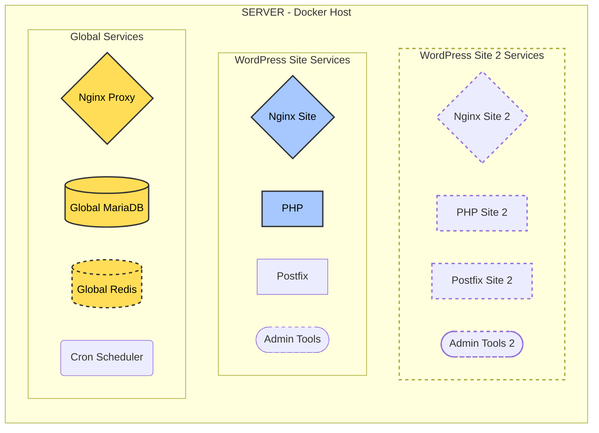
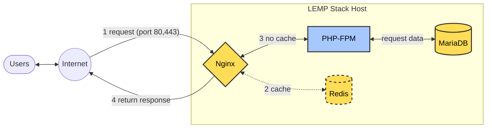
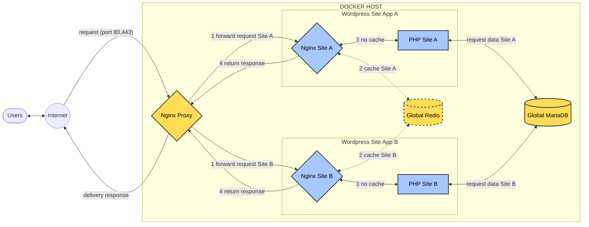

Nếu bạn chưa biết gì về Docker, cũng chẳng sao, EasyEngine 4 làm hết mọi việc và bạn chỉ cần sử dụng, kèm một vài lưu ý về sự khác biệt, cách bạn can thiệp so với LEMP stack thông thường. Nhưng dành một chút thời gian tìm hiểu về các khái niệm cơ bản của Docker sẽ hữu ích vô cùng khi bạn vận hành EasyEngine, nó cũng mang lại nhiều thú vị cho công việc của bạn.

## Khái niệm Docker cần nắm

Dưới đây là bảng so sánh để dễ hình dung:

| **Tiêu chí** | **LEMP truyền thống** | **LEMP Docker hóa** |
| --- | --- | --- |
| **Cài phần mềm** | Cài qua apt/yum, ví dụ `apt install nginx` | Dùng hình ảnh, ví dụ `docker pull nginx` |
| **Cấu hình** | Chỉnh file trên host, ví dụ `/etc/nginx` | Biến môi trường và file cấu hình trong volumes |
| **Quản lý dịch vụ** | Sử dụng systemctl, ví dụ: `systemctl start nginx` | Sử dụng lệnh Docker, ví dụ: `docker start nginx-container` |
| **Lưu dữ liệu** | Lưu trong host, ví dụ `/var/lib/mysql` | Dùng volumes, ví dụ `-v mysql-data:/var/lib/mysql` |
| **Giao tiếp dịch vụ** | Qua localhost (127.0.0.1) | Qua mạng Docker, cần cấu hình |
| **Cập nhật** | Nâng cấp gói trên host | Tải hình ảnh mới, tạo lại container |
| **Bảo mật** | Quản lý quyền trên host | Cách ly container, quản lý quyền container |

**Images (Hình ảnh):**

- Thay vì cài phần mềm trên host, bạn dùng hình ảnh Docker, ví dụ [nginx](https://hub.docker.com/_/nginx), [mysql](https://hub.docker.com/_/mysql), [php](https://hub.docker.com/_/php). Hình ảnh chứa mã, thư viện, và cấu hình để chạy dịch vụ.
- Bạn có thể xây dựng hình ảnh tùy chỉnh qua Dockerfile nếu cần, ví dụ thêm module PHP hoặc cấu hình NGINX đặc biệt.

**Container:**

- Container là thực thể chạy từ hình ảnh, mỗi container cách ly, chạy một dịch vụ (NGINX, MySQL, PHP).
- Khác với chương trình trên host, container có file system riêng, không ảnh hưởng trực tiếp đến host, giúp cách ly và dễ gỡ lỗi.

**Docker Compose:**

- Công cụ để định nghĩa và quản lý nhiều container, thay thế việc chạy từng lệnh `docker run`.
- Ví dụ, file `docker-compose.yml` định nghĩa NGINX, PHP-FPM, MySQL, mạng, và volumes, giúp khởi động toàn bộ stack bằng `docker-compose up`.
- So với LEMP truyền thống, đây giống như quản lý toàn bộ stack qua một file, thay vì cấu hình từng dịch vụ riêng lẻ.

**Volumes:**

- Thay vì lưu dữ liệu trong thư mục host như `/var/lib/mysql`, bạn dùng volumes để lưu dữ liệu lâu dài.
- Ví dụ, gắn volume cho MySQL: `-v mysql-data:/var/lib/mysql`, đảm bảo dữ liệu không mất khi container bị xóa.
- Điều này quan trọng cho cơ sở dữ liệu và file web, khác với cách lưu trực tiếp trên host.

**Networks (Mạng):**

- Trong LEMP truyền thống, dịch vụ giao tiếp qua localhost (127.0.0.1). Trong Docker, bạn cần tạo mạng, ví dụ `docker network create lemp-net`, và gắn container vào mạng để giao tiếp.
- Ví dụ, NGINX cần kết nối với PHP-FPM qua mạng, không dùng socket Unix như trước, mà qua TCP (port mapping hoặc alias mạng).

**Port Mapping (Ánh xạ cổng):**

- Để truy cập dịch vụ từ bên ngoài, bạn ánh xạ cổng host sang container, ví dụ `-p 80:80` cho NGINX.
- Khác với LEMP truyền thống, nơi cổng được bind trực tiếp trên host, đây là bước cần thiết để tiếp cận container.

**Environment Variables (Biến môi trường):**

- Thay vì chỉnh sửa file cấu hình trên host, bạn có thể cấu hình dịch vụ qua biến môi trường, ví dụ `MYSQL_ROOT_PASSWORD` cho MySQL.
- Điều này giúp linh hoạt, đặc biệt khi triển khai trên nhiều môi trường (dev, prod).

**Quản lý vòng đời container:**

- Thay vì dùng `systemctl`, bạn dùng lệnh như `docker start`, `docker stop`, `docker restart` để quản lý container.
- Docker Compose cũng hỗ trợ, ví dụ `docker-compose up -d` để chạy nền, `docker-compose down` để dừng.

**Quản lý log:**

- Trong LEMP truyền thống, log nằm ở `/var/log/nginx`, `/var/log/mysql`. Trong Docker, log được gửi ra stdout/stderr, xem qua `docker logs <container_name>`.
- Bạn có thể cấu hình driver log (như journald) để tích hợp với hệ thống log host.

**Bảo mật:**

- Đảm bảo không chạy container với quyền root không cần thiết, và dùng volumes an toàn cho dữ liệu nhạy cảm.
- Container cách ly quy trình, giảm rủi ro ảnh hưởng chéo giữa dịch vụ.

Đến đây bạn hình dung được nhưng có thể không nhớ và biết chính xác cần làm gì? Đừng lo lắng, EasyEngine 4 đã tự động thiết lập, quản lý, kết nối, tối ưu các nghiệp vụ này. Nếu bạn chỉ cần setup server, cài đặt WordPress và vận hành WordPress, bạn chẳng bao giờ đụng đến những thứ này. Nó sẽ hữu ích khi bạn bắt đầu muốn một số can thiệp cá nhân hay muốn hiểu biết thêm.

## Cấu trúc của EasyEngine

Cài đặt EasyEngine, thật ra là cài đặt:

- Docker/Docker Compose để vận hành container
- PHP-CLI/modules và gói Phar EasyEngine để thực thi các lệnh EE-CLI

Còn các thành phần LEMP stack và website được quản lý trong container, và bạn sẽ tương tác với các container này.

Trong khi LEMP stack truyền thống, tất cả được cài đặt trong server gồm Nginx, MariaDB, PHP. EasyEngine 4 cài đặt nó vào các container và chia nó thành 2 nhóm chính: Global Services và Site:

1. **Global Services**: Nginx Proxy, MariaDB, Redis (nếu dùng cache) và Cron Scheduler
2. **Site**: Nginx site, PHP, Postfix, Admin Tools (mặc định không cài). Nếu bạn cài thêm một site WordPress, một nhóm container site như này sẽ được cài thêm cho site đó.



Bạn đang thấy nó quá rối đúng không? Tôi sẽ giải thích ngay cách nó làm việc thông minh ra sao và điều đó sẽ làm bạn thấy nó đơn giản trở lại.

Tham khảo:

[Global Filesystem Structure](https://easyengine.io/handbook/global-filesystem-structure/)

## Cách hoạt động của EasyEngine 4

Trước hết, ôn lại cách làm việc của LEMP stack truyền thống, tôi thêm Redis để bạn dễ hình dung và so sánh.



Với chỉ Nginx-PHP-MariaDB, nó xử lý cho mọi website bạn cài đặt, tất cả dùng chung các chương trình này. User yêu cầu một trang web qua cổng 80/443, Nginx phân tích các yêu cầu này và xử lý qua PHP-MariaDB và phản hồi yêu cầu đó. Nếu có dùng Redis, Nginx sẽ kiểm tra Redis trước.

Nhưng khi sử dụng Docker/container, EasyEngine hoạt động như thế này:



**Nginx Proxy**

Trước tiên, để xử lý các yêu cầu, EasyEngine 4 dùng 2 Nginx:

- Nginx proxy: lắng nghe cổng 80/443 cho mọi yêu cầu website từ Internet, sau đó chuyển tiếp đến Nginx site tương ứng.
- Nginx site: thực sự xử lý các yêu cầu website và trả lại kết quả cho proxy.

**Global Services**

Có 3 chương trình dùng chung cho mọi website, lựa chọn này giảm công cấu hình và yêu cầu hệ thống.

- Nginx proxy: như đã trình bày ở trên.
- Global MariaDB: tất cả các website đều dùng chung một database này.
- Global Redis: với lưu trữ cache cũng được dùng chung.

**Sites**

Các site khác nhau có Nginx và PHP riêng biệt, giúp các website độc lập, một lợi ích lớn từ Docker.

Tham khảo: [EasyEngine HTTP Request Cycle](https://easyengine.io/handbook/internal/request-cycle/)

## Dữ liệu của bạn được lưu ở đâu

Bây giờ, chúng ta xem lại dữ liệu sẽ được lưu ở đâu, điều này giúp bạn biết upload nội dung website vào đâu và can thiệp cấu hình như thế nào.

```bash
sample-site.com
├── app
│   ├── htdocs                  # Source code của website
│   └── wp-config.php           # File cấu hình WordPress
├── config
│   ├── nginx                   # Cấu hình NGINX
│   ├── php                     # Cấu hình PHP
│   └── postfix                 # Cấu hình Postfix (nếu sử dụng)
├── logs
│   ├── nginx                   # Log của NGINX (access.log, error.log)
│   └── php                     # Log PHP-FPM (access.log, error.log)
├── services
│   └── postfix                 # Dịch vụ mail Postfix (nếu sử dụng)
├── docker-compose.yml          # Docker Compose chính để chạy site
└── docker-compose-admin.yml    # Docker Compose cho admin-tools (nếu kích hoạt)
```

**Source Code**

| Mô tả | Đường dẫn |
| --- | --- |
| Source code của site | `/opt/easyengine/sites/example.com/app/htdocs/` |
| File `wp-config.php` (nếu là WordPress) | `/opt/easyengine/sites/example.com/app/wp-config.php` |

**Configuration**

| Loại cấu hình | Đường dẫn |
| --- | --- |
| Cấu hình Nginx | `/opt/easyengine/sites/example.com/config/nginx/` |
| Cấu hình Nginx tùy chỉnh (sẽ không bị ghi đè khi update) | `/opt/easyengine/sites/example.com/config/nginx/custom/` |
| Cấu hình PHP | `/opt/easyengine/sites/example.com/config/php/php/` |
| Cấu hình PHP-FPM | `/opt/easyengine/sites/example.com/config/php/php-fpm.d/` |

**Logs**

| Loại log | Đường dẫn |
| --- | --- |
| Log Nginx | `/opt/easyengine/sites/example.com/logs/nginx/` |
| Log PHP | `/opt/easyengine/sites/example.com/logs/php/` |

Tham khảo: [EasyEngine Site Filesystem Structure](https://easyengine.io/handbook/global-filesystem-structure/site-filesystem-structure/)

## Tóm tắt sự khác nhau khi triển khai với EasyEngine 4

| **Tiêu chí** | **LEMP truyền thống** | **LEMP Docker hóa** | **EasyEngine** |
| --- | --- | --- | --- |
| **Cài phần mềm** | Cài qua `apt/yum`, ví dụ `apt install nginx`, hoặc được cài đặt và cấu hình tự động với Centminmod, WordOps... | Dùng Docker image, ví dụ `docker pull nginx` | Tự động kéo image Docker và cấu hình qua lệnh `ee site create` |
| **Cấu hình** | Chỉnh file trên host, ví dụ `/etc/nginx` | Dùng volumes/biến môi trường | Cấu hình site `/opt/easyengine/sites/example.com/config/`  
Cấu hình các dịch vụ Global `/opt/easyengine/services/nginx-proxy/` |
| **Quản lý dịch vụ** | Sử dụng systemctl, ví dụ: `systemctl start nginx` | Lệnh Docker, ví dụ: `docker start nginx-container` | Lệnh `ee`, dịch vụ site: `ee site reload sample.com`  
Dịch vụ global: `ee service reload --nginx` |
| **Lưu dữ liệu** | Lưu trên host, ví dụ `/var/lib/mysql` | Dùng volumes, ví dụ `-v mysql-data:/var/lib/mysql` | Lưu tại `/opt/easyengine/services/mariadb/data` |
| **Giao tiếp dịch vụ** | Qua localhost (`127.0.0.1`) | Qua mạng Docker, cần cấu hình | Dùng mạng nội bộ của Docker do EasyEngine tự tạo |
| **Cập nhật** | Nâng cấp gói trên host | Tải image mới, tạo lại container | Cập nhật container bằng `ee cli update` và `ee service update` |
| **Bảo mật** | Quản lý quyền trên host | Cách ly container, quản lý quyền container | Chạy mỗi site trong container riêng, dễ dàng rollback |

## Tham khảo

- [Bài viết về những thay đổi từ cách EasyEngine chuyển từ LEMP stack truyền thống qua Docker](https://easyengine.io/handbook/v3-to-v4-migration/)
- [Cron Scheduler dựa trên Ofelia](https://github.com/mcuadros/ofelia)
- [Proxy nginx dựa trên image này](https://github.com/nginx-proxy/nginx-proxy)
- [Nginx site dựa trên OpenResty](https://openresty.org/en/)

