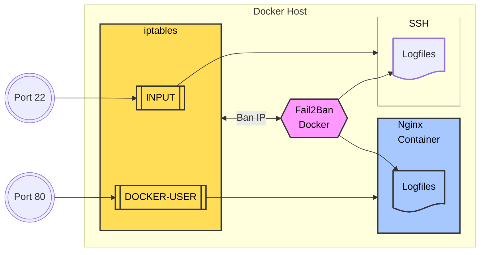

Security is always a concern when deploying a web server. With EasyEngine, this process becomes much simpler since Docker provides strong isolation, software updates are easy to apply, and the system remains inherently secure.

EasyEngine also includes some built-in security measures, such as setting `time-request-limit` for `wp-login.php` to prevent brute-force attacks.

However, in cases where you want to enhance protection or reduce server load, you’ll need Fail2Ban, the "default" software for server protection. This guide will teach you how to deploy Fail2Ban on a Docker-based server.

This guide assumes you are running **Debian 12** with the default firewall **nftables**.

## What is Fail2Ban?

Fail2Ban is a security tool that protects Linux systems from brute-force attacks and unauthorized access by analyzing log files and blocking suspicious IP addresses. When used with Docker, Fail2Ban can safeguard both the **host server (Debian)** and the **Docker containers** running on it.

Fail2Ban operates in three main steps:

1. **Monitoring logs**: It scans system or service log files (e.g., SSH logs, web server logs) to detect suspicious activity patterns (defined by filters), such as multiple failed login attempts from the same IP.
2. **Detecting violations**: When the number of failed attempts exceeds a predefined threshold within a specific time (e.g., 5 failed logins in 10 minutes), Fail2Ban flags the IP as suspicious.
3. **Applying ban rules**: Fail2Ban then adds rules to **iptables** to block the IP for a set period. In a Docker environment, these rules are applied to the **DOCKER-USER** chain in iptables, ensuring that traffic from banned IPs is blocked before reaching the container.



Fail2Ban operates using three key components: **Jail, Filter, and Action**.

- **Jail:** Defines the service that needs protection. Each jail is associated with a filter to detect suspicious behavior and an action to determine how to respond. It also specifies which log files Fail2Ban should monitor.
- **Filter:** Contains regular expressions (regex) used to analyze logs and detect suspicious requests or activities. If a log entry matches the regex, Fail2Ban considers it a violation and alerts the jail.
- **Action:** Determines how Fail2Ban responds to a detected violation. Common actions include blocking the IP using **iptables** or **nftables**, logging warnings, or sending email notifications. Actions help prevent ongoing attacks and protect the system efficiently.

## Installing Fail2Ban with Docker  

The principle of Dockerization is to minimize intervention on the host server—everything runs within a container. Here, we follow the same approach by installing Fail2Ban inside a container using the `crazymax/fail2ban` image.  

### Steps to implement:  

1. Prepare the `docker-compose.yml` and `.env` files, which dictate how Docker operates.  
2. Configure jails, actions, and filters.  
3. Run Fail2Ban with Docker.  

## `docker-compose.yml`  

Create a directory for the Fail2Ban Docker setup:  

```bash
mkdir ~/fail2ban && cd ~/fail2ban
```  

Create the `docker-compose.yml` file, which instructs Docker on how to set up the Fail2Ban container:  

```bash
nano docker-compose.yml
```  

Copy and paste the following content into the file:  

```yaml
services:
  fail2ban:
    image: crazymax/fail2ban:latest
    container_name: fail2ban
    network_mode: "host"
    cap_add:
      - NET_ADMIN
      - NET_RAW
    volumes:
      - "./data:/data"  # Stores custom jails, actions, filters, and the Fail2Ban persistent database
      - "/opt/easyengine/services/nginx-proxy/logs:/var/log/nginx-proxy:ro"  # Logs from nginx-proxy
      - "/opt/easyengine/sites/sample.com/logs/nginx:/var/log/sample.com-nginx:ro"  # Logs from the Nginx site
    environment:
      - F2B_LOG_TARGET=STDOUT
      - F2B_LOG_LEVEL=INFO
      - F2B_DB_PURGE_AGE=1d
    restart: unless-stopped
```  

## Creating a Jail  

This is my jail setup to prevent common WordPress attacks. The jail file is created in the `~/fail2ban/data/jail.d/jail.local` directory.  

```bash
mkdir -p ~/fail2ban/data/jail.d
nano ~/fail2ban/data/jail.d/jail.local
```  

Copy and paste the following content into the `jail.local` file. Pay special attention to the `chain = DOCKER-USER` setting, as Fail2Ban will insert ban rules into this chain to be effective in a Dockerized system.  

```bash
[DEFAULT]

ignoreip = 116.110.40.117 127.0.0.1/8 ::1 10.0.0.0/20 

chain = DOCKER-USER 

findtime = 10m
maxretry = 5
bantime = 10m

# "bantime.increment" allows the use of a database to track previously banned IPs 
# and increase ban durations based on a special formula: default is bantime * 1, 2, 4, 8, 16, 32...
bantime.increment = true

# "bantime.rndtime" is the maximum random time added 
# to prevent "smart" botnets from calculating the exact time an IP will be unbanned.
bantime.rndtime = 2048

# Example for gradually increasing ban times.
# With bantime=60, the multipliers are: 1 min, 5 min, 30 min, 1 hour, 5 hours, 12 hours, 1 day, 2 days.
bantime.multipliers = 1 5 30 60 300 720 1440 2880

# WORDOPS TEAM  

# Ban WordPress login failures  
[wp-login-fail]
enabled  = true
filter   = wp-login-fail
port     = http,https
logpath  = /var/log/nginx-proxy/access.log
findtime = 24h
maxretry = 10
bantime  = 1d

# EASYENGINE TEAM  

# Ban excessive request limits on Nginx  
[nginx-req-limit]
enabled  = true
filter   = nginx-req-limit
port     = http,https
protocol = tcp
logpath  = /var/log/*-nginx/error.log
findtime = 10m
bantime  = 2h
maxretry = 10

# R-PUFKY DOCS  
# https://r-pufky.github.io/docs/services/fail2ban/setup-docker.html  

# Ban failed HTTP authentication on Nginx  
[nginx-http-auth]
enabled  = true
filter   = nginx-http-auth
port     = http,https
logpath  = /var/log/nginx-proxy/error.log
bantime  = 24h
findtime = 2h
maxretry = 3

# Ban requests for non-existent files/directories  
[nginx-no-file-directory]
enabled  = true
filter   = nginx-no-file-directory
port     = http,https
logpath  = /var/log/nginx-proxy/error.log
bantime  = 24h
findtime = 2h
maxretry = 6

# Ban forbidden index access  
[nginx-forbidden]
enabled  = true
filter   = nginx-forbidden
port     = http,https
logpath  = /var/log/*-nginx/error.log
bantime  = 24h
findtime = 2h
maxretry = 6

# Ban clients causing repeated errors  
[nginx-errors]
enabled  = true
filter   = nginx-errors
port     = http,https
logpath  = /var/log/nginx-proxy/access.log
bantime  = 24h
findtime = 2h
maxretry = 6

# Ban requests attempting to find malicious scripts  
[nginx-noscript]
enabled  = true
filter   = nginx-noscript
port     = http,https
logpath  = /var/log/nginx-proxy/access.log
bantime  = 24h
findtime = 2h
maxretry = 6

# Ban known malicious bots  
[nginx-badbots]
enabled  = true
filter   = nginx-badbots
port     = http,https
logpath  = /var/log/nginx-proxy/access.log
bantime  = 24h
findtime = 2h
maxretry = 6

# Ban access to user directories  
[nginx-nohome]
enabled  = true
filter   = nginx-nohome
port     = http,https
logpath  = /var/log/nginx-proxy/access.log
bantime  = 24h
findtime = 2h
maxretry = 6

# Ban requests using open proxies  
[nginx-noproxy]
enabled  = true
filter   = nginx-noproxy
port     = http,https
logpath  = /var/log/nginx-proxy/access.log
bantime  = 24h
findtime = 2h
maxretry = 6
```

## Creating Fail2Ban Filters  

Below is a list of filter configuration files for Fail2Ban to protect Nginx and WordPress from common attacks.

### Creating the Filter Directory
Before creating the configuration files, ensure the `filter.d` directory exists:

```bash
mkdir -p ~/fail2ban/data/filter.d
```

### Creating and Populating Configuration Files

`wp-login-fail.conf`
```bash
nano ~/fail2ban/data/filter.d/wp-login-fail.conf
```
Content:
```
[Definition]
failregex = ^<HOST>.* "POST .*/wp-login.php([/?#\\].*)? HTTP/.*" 200
ignoreregex =
```

`nginx-req-limit.conf`
```bash
nano ~/fail2ban/data/filter.d/nginx-req-limit.conf
```
Content:
```
[Definition]
failregex = limiting requests, excess:.* by zone.*client: <HOST>
ignoreregex =
```

`nginx-badbots.conf`
```bash
nano ~/fail2ban/data/filter.d/nginx-badbots.conf
```
Content:
```
[Definition]
failregex = ^<HOST> -.*"(GET|POST|HEAD).*HTTP.*"(?:badbots|badbotscustom)"$
ignoreregex = .*Googlebot.*|.*Bingbot.*
```

`nginx-http-auth.conf`
```bash
nano ~/fail2ban/data/filter.d/nginx-http-auth.conf
```
Content:
```
[Definition]
failregex = ^ \[error\] \d+#\d+: \*\d+ user "(?:[^"]+|.*?)":? (?:password mismatch|was not found in "[^"]*"), client: <HOST>
ignoreregex =
```

`nginx-nohome.conf`
```bash
nano ~/fail2ban/data/filter.d/nginx-nohome.conf
```
Content:
```
[Definition]
failregex = ^<HOST> -.*GET .*/~.*
ignoreregex =
```

`nginx-noproxy.conf`
```bash
nano ~/fail2ban/data/filter.d/nginx-noproxy.conf
```
Content:
```
[Definition]
failregex = ^<HOST> -.*GET http.*
ignoreregex =
```

`nginx-noscript.conf`
```bash
nano ~/fail2ban/data/filter.d/nginx-noscript.conf
```
Content:
```
[Definition]
failregex = ^<HOST>.* "(GET|POST) .*/.*\.(php|asp|exe|pl|cgi|scgi)(\?.*)? HTTP/.*"
ignoreregex = ^<HOST>.* "(GET|POST) .*/wp-login\.php.*$"
              ^<HOST>.* "(GET|POST) .*/wp-admin/.*$"
              ^<HOST>.* "(GET|POST) .*/wp-json/.*$"
```

`nginx-forbidden.conf`
```bash
nano ~/fail2ban/data/filter.d/nginx-forbidden.conf
```
Content:
```
[Definition]
failregex = ^.*\[error\] \d+#\d+: .* is forbidden, client: <HOST>.*$
ignoreregex =
```

`nginx-no-file-directory.conf`
```bash
nano ~/fail2ban/data/filter.d/nginx-no-file-directory.conf
```
Content:
```
[Definition]
failregex = ^.*\[error\] \d+#\d+: .*No such file or directory.*client: <HOST>.*$
ignoreregex = ^.* "(GET|POST|HEAD) .*/[^ ]*\.(png|txt|jpg|ico|js|css|ttf|woff|woff2|svg|map)(\?.*)? HTTP/.*"
```

`nginx-errors.conf`
```bash
nano ~/fail2ban/data/filter.d/nginx-errors.conf
```
Content:
```
[Definition]
failregex = ^<HOST> -.* "(GET|POST|HEAD) .+ HTTP/.*" (40[0-7]|41[0-8]) .*$
ignoreregex = ^<HOST>.* "(GET|POST|HEAD) .*/[^ ]*\.(png|txt|jpg|ico|js|css|ttf|woff|woff2|svg|map)(\?.*)? HTTP/.*"
              ^<HOST>.* "(GET|POST|HEAD) .*/wp-json/.* HTTP/.*"
              ^<HOST>.* "(GET|POST|HEAD) .*/wp-admin/.* HTTP/.*"
              ^<HOST>.* "(GET|POST|HEAD) .*/wp-login\.php.* HTTP/.*"
```

---

## Running Fail2Ban with Docker

With the prepared files, we are ready to run Fail2Ban using Docker.

### File Structure:
```bash
~/fail2ban/
├── docker-compose.yml
└── data/
    ├── jail.d/
    │   └── jail.local
    └── filter.d/
        ├── wp-login-fail.conf
        ├── nginx-req-limit.conf
        ├── nginx-badbots.conf
        ├── nginx-http-auth.conf
        ├── nginx-nohome.conf
        ├── nginx-noproxy.conf
        ├── nginx-noscript.conf
        ├── nginx-forbidden.conf
        ├── nginx-no-file-directory.conf
        └── nginx-errors.conf
```

### Ensure You Are in the `~/fail2ban` Directory:
```bash
cd ~/fail2ban
```

### Start Fail2Ban Docker:
```bash
# Run Fail2Ban in the background
docker-compose up -d 
```

### View Fail2Ban Logs:
```bash
docker-compose logs -f
```

### Check Banned IPs in All Jails:
```bash
docker-compose exec fail2ban fail2ban-client status --all
```

### Unban an IP:
Sometimes Fail2Ban may mistakenly block an IP. To unban `123.123.123.123` from the `nginx-errors` jail:
```bash
docker-compose exec fail2ban fail2ban-client set nginx-errors unbanip 123.123.123.123
```

## Whitelist

Sometimes, strict Fail2Ban jails may block important access from bots such as Google, ChatGPT, and Facebook. Our solution is to whitelist the published IP addresses of Google, ChatGPT, Facebook, and all necessary services for your website in Fail2Ban.

To whitelist Fail2Ban, add the IP addresses to the `ignoreip` section under `[DEFAULT]` in the `jail.local` file.

For example, to allow Google Bot, add the following lines to the file:

```bash
[DEFAULT]
ignoreip = 192.178.5.0/27 192.178.6.0/27 192.178.6.32/27 192.178.6.64/27 34.100.182.96/28 34.101.50.144/28 34.118.254.0/28 34.118.66.0/28 34.126.178.96/28 34.146.150.144/28 34.147.110.144/28 34.151.74.144/28 34.152.50.64/28 34.154.114.144/28 34.155.98.32/28 34.165.18.176/28 34.175.160.64/28 34.176.130.16/28 34.22.85.0/27 34.64.82.64/28 34.65.242.112/28 34.80.50.80/28 34.88.194.0/28 34.89.10.80/28 34.89.198.80/28 34.96.162.48/28 35.247.243.240/28 66.249.64.0/27 66.249.64.128/27 66.249.64.160/27 66.249.64.224/27 66.249.64.32/27 66.249.64.64/27 66.249.64.96/27 66.249.65.0/27 66.249.65.128/27 66.249.65.160/27 66.249.65.192/27 66.249.65.224/27 66.249.65.32/27 66.249.65.64/27 66.249.65.96/27 66.249.66.0/27 66.249.66.160/27 66.249.66.192/27 66.249.66.32/27 66.249.66.64/27 66.249.66.96/27 66.249.68.0/27 66.249.68.32/27 66.249.68.64/27 66.249.68.96/27 66.249.69.0/27 66.249.69.128/27 66.249.69.160/27 66.249.69.192/27 66.249.69.224/27 66.249.69.32/27 66.249.69.64/27 66.249.69.96/27 66.249.70.0/27 66.249.70.128/27 66.249.70.160/27 66.249.70.192/27 66.249.70.224/27 66.249.70.32/27 66.249.70.64/27 66.249.70.96/27 66.249.71.0/27 66.249.71.128/27 66.249.71.160/27 66.249.71.192/27 66.249.71.224/27 66.249.71.32/27 66.249.71.64/27 66.249.71.96/27 66.249.72.0/27 66.249.72.128/27 66.249.72.160/27 66.249.72.192/27 66.249.72.224/27 66.249.72.32/27 66.249.72.64/27 66.249.72.96/27 66.249.73.0/27 66.249.73.128/27 66.249.73.160/27 66.249.73.192/27 66.249.73.224/27 66.249.73.32/27 66.249.73.64/27 66.249.73.96/27 66.249.74.0/27 66.249.74.128/27 66.249.74.160/27 66.249.74.32/27 66.249.74.64/27 66.249.74.96/27 66.249.75.0/27 66.249.75.128/27 66.249.75.160/27 66.249.75.192/27 66.249.75.224/27 66.249.75.32/27 66.249.75.64/27 66.249.75.96/27 66.249.76.0/27 66.249.76.128/27 66.249.76.160/27 66.249.76.192/27 66.249.76.224/27 66.249.76.32/27 66.249.76.64/27 66.249.76.96/27 66.249.77.0/27 66.249.77.128/27 66.249.77.160/27 66.249.77.192/27 66.249.77.224/27 66.249.77.32/27 66.249.77.64/27 66.249.77.96/27 66.249.78.0/27 66.249.78.32/27 66.249.79.0/27 66.249.79.128/27 66.249.79.160/27 66.249.79.192/27 66.249.79.224/27 66.249.79.32/27 66.249.79.64/27 66.249.79.96/27
```

### Recommended IPs to Whitelist

1. Home IP: 123.123.123.123  
2. Internal Server IP: 127.0.0.1/8 ::1  
3. `services_global-nginx-proxy_1` IP: 10.1.0.3  
4. [Cloudflare IPs](https://www.cloudflare.com/ips/)  
5. [Google Bot IPs](https://developers.google.com/search/docs/crawling-indexing/verifying-googlebot)  
6. [Google Special-Crawlers](https://developers.google.com/search/docs/crawling-indexing/verifying-googlebot)  
7. [Google User-Triggered Fetchers](https://developers.google.com/search/docs/crawling-indexing/verifying-googlebot)  
8. [Google User-Triggered Fetchers - Google](https://developers.google.com/search/docs/crawling-indexing/verifying-googlebot)  
9. [Google Other IPs](https://developers.google.com/search/docs/crawling-indexing/verifying-googlebot)  
10. [Common Crawl](https://commoncrawl.org/faq)  
11. [Bing Bot IPs](https://searchengineland.com/microsoft-list-of-bingbot-ip-addresses-released-376039)  
12. [ChatGPT Bot IPs](https://platform.openai.com/docs/bots)  

### References:

https://github.com/crazy-max/docker-fail2ban