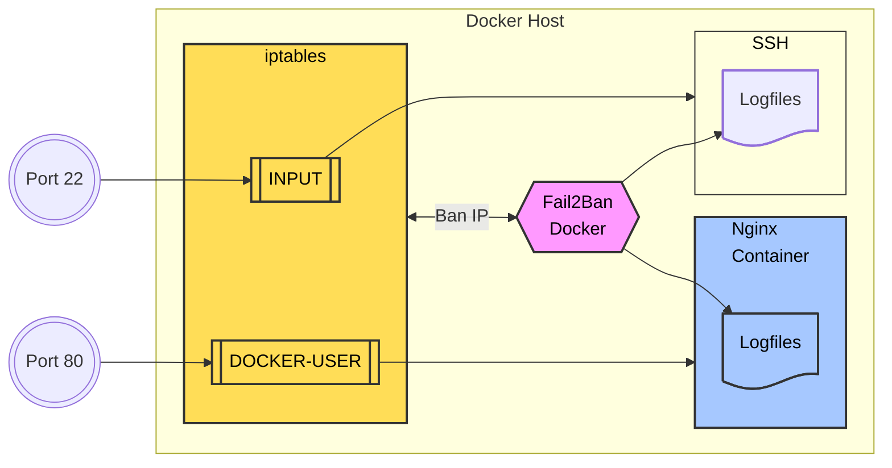

Bảo mật luôn làm các bạn lo lắng khi tự triển khai web server. Với EasyEngine, đây là một việc nhẹ nhõm hơn nhiều vì bản thân Docker cách ly rất tốt, phần mềm luôn mới vì dễ cập nhật, nên bản thân nó đã là một hệ thống an toàn.

EasyEngine cũng đã thiết lập một số bảo mật, như thiết lập `time-request-limit` với `wp-login.php` để tránh tấn công brute-force.

Nhưng có nhiều trường hợp bạn muốn bảo vệ hoặc giảm tải server, bạn sẽ cần dùng Fail2Ban, phần mềm "mặc định" cho việc bảo vệ server. Và qua đây, bạn sẽ học cách tự triển khai phần mềm trên hệ thống server Docker hóa.

Hướng dẫn này mặc định là bạn chạy Debian 12, với tường lửa mặc định `nftables`.

## Fail2Ban là gì

Fail2Ban là một công cụ bảo mật giúp bảo vệ hệ thống Linux khỏi các cuộc tấn công brute-force hoặc truy cập trái phép thông qua việc phân tích các log file và chặn địa chỉ IP đáng ngờ. Khi được sử dụng cùng Docker, Fail2Ban có thể bảo vệ cả server (Debian) và các container Docker đang chạy trên nó.

Fail2Ban hoạt động dựa trên ba bước chính:

1. **Giám sát nhật ký**: Công cụ quét các tệp nhật ký của hệ thống hoặc dịch vụ (ví dụ: nhật ký SSH, web server) để tìm các mẫu (patterns) (dựa theo filter) cho thấy hành vi bất thường, chẳng hạn như nhiều lần đăng nhập thất bại từ một địa chỉ IP.
2. **Phát hiện vi phạm**: Khi số lần thất bại vượt quá ngưỡng được định nghĩa trước trong một khoảng thời gian cụ thể (ví dụ: 5 lần thất bại trong 10 phút), Fail2Ban xác định đó là hành vi đáng ngờ.
3. **Áp dụng quy tắc cấm**: Fail2Ban sau đó thêm quy tắc vào iptables để chặn địa chỉ IP đó trong một khoảng thời gian nhất định. Đối với container Docker, quy tắc này được thêm vào chuỗi `DOCKER-USER` của iptables, đảm bảo rằng lưu lượng từ IP bị chặn không thể đến container.



Hoạt động của Fail2Ban dựa trên ba thành phần chính: **Jail**, **Filter** và **Action**:

- **Jail:** Jail trong Fail2Ban là nơi định nghĩa dịch vụ cần bảo vệ. Mỗi jail sẽ liên kết với một filter để xác định hành vi đáng ngờ và một action để quyết định cách xử lý. Ngoài ra, jail cũng chỉ định logfile mà Fail2Ban cần giám sát để phát hiện các hành vi vi phạm.
- **Filter:** Filter chứa các biểu thức chính quy (regex) giúp phân tích logfile và phát hiện các yêu cầu hoặc hành động bất thường. Khi một mục nhập trong logfile khớp với regex trong filter, Fail2Ban sẽ xem đó là một hành vi vi phạm và báo cho jail xử lý.
- **Action:** Action xác định cách Fail2Ban phản ứng khi phát hiện vi phạm. Các hành động phổ biến bao gồm chặn IP bằng iptables hoặc nftables, ghi log cảnh báo hoặc gửi email thông báo. Action giúp ngăn chặn các cuộc tấn công tiếp diễn và bảo vệ hệ thống hiệu quả.

## Cài đặt Fail2Ban với Docker

Nguyên tắc Docker hóa là can thiệp cực kỳ tối thiểu vào server host, tất cả đều được chạy trong container. Và ở đây, chúng ta cũng làm như vậy khi cài đặt Fail2Ban trong container, và image được chọn là `crazymax/fail2ban`.

Các bước tiến hành:

1. Chuẩn bị file `docker-compose.yml`, `.env`: chỉ thị cách Docker vận hành.
2. Thiết lập jail, action, filter.
3. Chạy Fail2Ban với Docker.

## docker-compose.yml

Lập thư mục chứa Fail2Ban Docker:

```bash
mkdir ~/fail2ban && cd ~/fail2ban
```

Tạo file `docker-compose.yml`, file chỉ thị cho Docker xây dựng Fail2Ban container:

```bash
nano docker-compose.yml
```

Chép nội dung này vào:

```yaml {filename="~/fail2ban/docker-compose.yml"}
services:
  fail2ban:
    image: crazymax/fail2ban:latest
    container_name: fail2ban
    network_mode: "host"
    cap_add:
      - NET_ADMIN
      - NET_RAW
    volumes:
      - "./data:/data"  # Chứa custom jails, actions, filters và Fail2Ban persistent database
      - "/opt/easyengine/services/nginx-proxy/logs:/var/log/nginx-proxy:ro"  # Log của nginx-proxy
      - "/opt/easyengine/sites/sample.com/logs/nginx:/var/log/sample.com-nginx:ro"  # Log của site Nginx
    environment:
      - F2B_LOG_TARGET=STDOUT
      - F2B_LOG_LEVEL=INFO
      - F2B_DB_PURGE_AGE=1d
    restart: unless-stopped
```

## Tạo Jail  

Đây là jail của tôi, chống lại các tấn công phổ biến trên WordPress. Jail được tạo trong thư mục `~/fail2ban/data/jail.d/jail.local`  

```bash
mkdir -p ~/fail2ban/data/jail.d
nano ~/fail2ban/data/jail.d/jail.local
```  

Chép nội dung sau đây vào file `jail.local` đang mở. Đặc biệt chú ý cài đặt `chain = DOCKER-USER`, Fail2Ban sẽ chèn lệnh cấm vào chain này để có tác dụng trong hệ thống Docker hóa.  

```bash {filename="~/fail2ban/data/jail.d/jail.local"}
[DEFAULT]

ignoreip = 116.110.40.117 127.0.0.1/8 ::1 10.0.0.0/20 

chain = DOCKER-USER 

findtime = 10m
maxretry = 5
bantime = 10m

# "bantime.increment" cho phép sử dụng cơ sở dữ liệu để tìm kiếm các IP bị cấm trước đó 
# và tăng thời gian cấm theo công thức đặc biệt: mặc định là bantime * 1, 2, 4, 8, 16, 32...
bantime.increment = true

# "bantime.rndtime" là số giây tối đa để trộn với thời gian ngẫu nhiên
# nhằm ngăn chặn botnet "thông minh" tính toán chính xác thời gian IP có thể được bỏ cấm:
bantime.rndtime = 2048

# Ví dụ sau có thể dùng để tăng thời gian cấm ban đầu nhỏ (bantime=60) - tăng dần theo thời gian.
# Với bantime=60, các hệ số nhân lần lượt là: 1 phút, 5 phút, 30 phút, 1 giờ, 5 giờ, 12 giờ, 1 ngày, 2 ngày.
bantime.multipliers = 1 5 30 60 300 720 1440 2880

# WORDOPS TEAM  

# Cấm truy cập WordPress khi đăng nhập thất bại
[wp-login-fail]
enabled  = true
filter   = wp-login-fail
port     = http,https
logpath  = /var/log/nginx-proxy/access.log
findtime = 24h
maxretry = 10
bantime  = 1d

# EASYENGINE TEAM  

# Cấm khi vượt quá giới hạn request trên Nginx
[nginx-req-limit]
enabled  = true
filter   = nginx-req-limit
port     = http,https
protocol = tcp
logpath  = /var/log/*-nginx/error.log
findtime = 10m
bantime  = 2h
maxretry = 10

# R-PUFKY DOCS  
# https://r-pufky.github.io/docs/services/fail2ban/setup-docker.html  

# Cấm khi thất bại xác thực HTTP trên Nginx  
[nginx-http-auth]
enabled  = true
filter   = nginx-http-auth
port     = http,https
logpath  = /var/log/nginx-proxy/error.log
bantime  = 24h
findtime = 2h
maxretry = 3

# Cấm truy cập sai file/thư mục  
[nginx-no-file-directory]
enabled  = true
filter   = nginx-no-file-directory
port     = http,https
logpath  = /var/log/nginx-proxy/error.log
bantime  = 24h
findtime = 2h
maxretry = 6

# Cấm truy cập vào index bị chặn  
[nginx-forbidden]
enabled  = true
filter   = nginx-forbidden
port     = http,https
logpath  = /var/log/*-nginx/error.log
bantime  = 24h
findtime = 2h
maxretry = 6

# Cấm các client liên tục gây lỗi  
[nginx-errors]
enabled  = true
filter   = nginx-errors
port     = http,https
logpath  = /var/log/nginx-proxy/access.log
bantime  = 24h
findtime = 2h
maxretry = 6

# Cấm truy vấn tìm kiếm script độc hại  
[nginx-noscript]
enabled  = true
filter   = nginx-noscript
port     = http,https
logpath  = /var/log/nginx-proxy/access.log
bantime  = 24h
findtime = 2h
maxretry = 6

# Cấm các bot độc hại đã biết  
[nginx-badbots]
enabled  = true
filter   = nginx-badbots
port     = http,https
logpath  = /var/log/nginx-proxy/access.log
bantime  = 24h
findtime = 2h
maxretry = 6

# Cấm truy cập vào thư mục người dùng  
[nginx-nohome]
enabled  = true
filter   = nginx-nohome
port     = http,https
logpath  = /var/log/nginx-proxy/access.log
bantime  = 24h
findtime = 2h
maxretry = 6

# Cấm các yêu cầu sử dụng proxy mở  
[nginx-noproxy]
enabled  = true
filter   = nginx-noproxy
port     = http,https
logpath  = /var/log/nginx-proxy/access.log
bantime  = 24h
findtime = 2h
maxretry = 6
```
## Tạo Filter Fail2Ban

Dưới đây là danh sách các tệp filter cấu hình cho Fail2Ban nhằm bảo vệ Nginx và WordPress khỏi các cuộc tấn công phổ biến.

### Tạo thư mục chứa Filter
Trước khi tạo các tệp cấu hình, hãy đảm bảo thư mục `filter.d` tồn tại:

```bash
mkdir -p ~/fail2ban/data/filter.d
```

### Tạo và điền nội dung các tệp cấu hình

#### `wp-login-fail.conf`
```bash
nano ~/fail2ban/data/filter.d/wp-login-fail.conf
```
Nội dung:
``` {filename="wp-login-fail.conf"}
[Definition]
failregex = ^<HOST>.* "POST .*/wp-login.php([/?#\\].*)? HTTP/.*" 200
ignoreregex =
```

#### `nginx-req-limit.conf`
```bash
nano ~/fail2ban/data/filter.d/nginx-req-limit.conf
```
Nội dung:
```{filename="nginx-req-limit.conf"}
[Definition]
failregex = limiting requests, excess:.* by zone.*client: <HOST>
ignoreregex =
```

#### `nginx-badbots.conf`
```bash
nano ~/fail2ban/data/filter.d/nginx-badbots.conf
```
Nội dung:
```{filename="nginx-badbots.conf"}
[Definition]
failregex = ^<HOST> -.*"(GET|POST|HEAD).*HTTP.*"(?:badbots|badbotscustom)"$
ignoreregex = .*Googlebot.*|.*Bingbot.*
```

#### `nginx-http-auth.conf`
```bash
nano ~/fail2ban/data/filter.d/nginx-http-auth.conf
```
Nội dung:
```{filename="nginx-http-auth.conf"}
[Definition]
failregex = ^ \[error\] \d+#\d+: \*\d+ user "(?:[^"]+|.*?)":? (?:password mismatch|was not found in "[^"]*"), client: <HOST>
ignoreregex =
```

#### `nginx-nohome.conf`
```bash
nano ~/fail2ban/data/filter.d/nginx-nohome.conf
```
Nội dung:
```{filename="nginx-nohome.conf"}
[Definition]
failregex = ^<HOST> -.*GET .*/~.*
ignoreregex =
```

#### `nginx-noproxy.conf`
```bash
nano ~/fail2ban/data/filter.d/nginx-noproxy.conf
```
Nội dung:
```{filename="nginx-noproxy.conf"}
[Definition]
failregex = ^<HOST> -.*GET http.*
ignoreregex =
```

#### `nginx-noscript.conf`
```bash
nano ~/fail2ban/data/filter.d/nginx-noscript.conf
```
Nội dung:
```{filename="ginx-noscript.conf"}
[Definition]
failregex = ^<HOST>.* "(GET|POST) .*/.*\.(php|asp|exe|pl|cgi|scgi)(\?.*)? HTTP/.*"
ignoreregex = ^<HOST>.* "(GET|POST) .*/wp-login\.php.*$"
              ^<HOST>.* "(GET|POST) .*/wp-admin/.*$"
              ^<HOST>.* "(GET|POST) .*/wp-json/.*$"
```

#### `nginx-forbidden.conf`
```bash
nano ~/fail2ban/data/filter.d/nginx-forbidden.conf
```
Nội dung:
```{filename="ginx-forbidden.conf"}
[Definition]
failregex = ^.*\[error\] \d+#\d+: .* is forbidden, client: <HOST>.*$
ignoreregex =
```

#### `nginx-no-file-directory.conf`
```bash
nano ~/fail2ban/data/filter.d/nginx-no-file-directory.conf
```
Nội dung:
```{filename="nginx-no-file-directory.conf"}
[Definition]
failregex = ^.*\[error\] \d+#\d+: .*No such file or directory.*client: <HOST>.*$
ignoreregex = ^.* "(GET|POST|HEAD) .*/[^ ]*\.(png|txt|jpg|ico|js|css|ttf|woff|woff2|svg|map)(\?.*)? HTTP/.*"
```

#### `nginx-errors.conf`
```bash
nano ~/fail2ban/data/filter.d/nginx-errors.conf
```
Nội dung:
```{filename="nginx-errors.conf"}
[Definition]
failregex = ^<HOST> -.* "(GET|POST|HEAD) .+ HTTP/.*" (40[0-7]|41[0-8]) .*$
ignoreregex = ^<HOST>.* "(GET|POST|HEAD) .*/[^ ]*\.(png|txt|jpg|ico|js|css|ttf|woff|woff2|svg|map)(\?.*)? HTTP/.*"
              ^<HOST>.* "(GET|POST|HEAD) .*/wp-json/.* HTTP/.*"
              ^<HOST>.* "(GET|POST|HEAD) .*/wp-admin/.* HTTP/.*"
              ^<HOST>.* "(GET|POST|HEAD) .*/wp-login\.php.* HTTP/.*"
```

## Vận hành Fail2Ban Docker

Như vậy, với các file đã chuẩn bị, chúng ta đã sẵn sàng vận hành Fail2Ban Docker.

```bash
~/fail2ban/
├── docker-compose.yml
└── data/
    ├── jail.d/
    │   └── jail.local
    └── filter.d/
        ├── wp-login-fail.conf
        ├── nginx-req-limit.conf
        ├── nginx-badbots.conf
        ├── nginx-http-auth.conf
        ├── nginx-nohome.conf
        ├── nginx-noproxy.conf
        ├── nginx-noscript.conf
        ├── nginx-forbidden.conf
        ├── nginx-no-file-directory.conf
        └── nginx-errors.conf
```

### Chạy Fail2Ban Docker
Đảm bảo bạn đang ở trong thư mục `~/fail2ban` để chạy các lệnh `docker-compose`:

```bash
cd ~/fail2ban
```

Chạy Fail2Ban Docker:
```bash
# Chạy nền Fail2Ban Docker
docker-compose up -d 
```

### Xem nhật ký hoạt động Fail2Ban
```bash
docker-compose logs -f
```

### Xem các IP đang bị chặn trên tất cả các jail
```bash
docker-compose exec fail2ban fail2ban-client status --all
```

### Unban một IP
Đôi khi Fail2Ban chặn nhầm, ví dụ: unban IP `123.123.123.123` trong jail `nginx-errors`:

```bash
docker-compose exec fail2ban fail2ban-client set nginx-errors unbanip 123.123.123.123
```

Dưới đây là phiên bản đã được chỉnh sửa chính tả:  

---

## Whitelist

Đôi khi, các jail khắt khe từ Fail2Ban sẽ chặn các truy xuất quan trọng từ bot của Google, ChatGPT và Facebook. Giải pháp của chúng ta là đưa các IP được công bố của Google, ChatGPT, Facebook… và tất cả các dịch vụ cần thiết cho website của bạn vào whitelist của Fail2Ban.  

Whitelist Fail2Ban được tạo bằng cách đưa các IP vào `ignoreip` trong phần `[DEFAULT]` của file `jail.local`.  

Ví dụ: Để cho phép Google Bot, thêm đoạn này vào file:

```bash
[DEFAULT]
ignoreip = 192.178.5.0/27 192.178.6.0/27 192.178.6.32/27 192.178.6.64/27 34.100.182.96/28 34.101.50.144/28 34.118.254.0/28 34.118.66.0/28 34.126.178.96/28 34.146.150.144/28 34.147.110.144/28 34.151.74.144/28 34.152.50.64/28 34.154.114.144/28 34.155.98.32/28 34.165.18.176/28 34.175.160.64/28 34.176.130.16/28 34.22.85.0/27 34.64.82.64/28 34.65.242.112/28 34.80.50.80/28 34.88.194.0/28 34.89.10.80/28 34.89.198.80/28 34.96.162.48/28 35.247.243.240/28 66.249.64.0/27 66.249.64.128/27 66.249.64.160/27 66.249.64.224/27 66.249.64.32/27 66.249.64.64/27 66.249.64.96/27 66.249.65.0/27 66.249.65.128/27 66.249.65.160/27 66.249.65.192/27 66.249.65.224/27 66.249.65.32/27 66.249.65.64/27 66.249.65.96/27 66.249.66.0/27 66.249.66.160/27 66.249.66.192/27 66.249.66.32/27 66.249.66.64/27 66.249.66.96/27 66.249.68.0/27 66.249.68.32/27 66.249.68.64/27 66.249.68.96/27 66.249.69.0/27 66.249.69.128/27 66.249.69.160/27 66.249.69.192/27 66.249.69.224/27 66.249.69.32/27 66.249.69.64/27 66.249.69.96/27 66.249.70.0/27 66.249.70.128/27 66.249.70.160/27 66.249.70.192/27 66.249.70.224/27 66.249.70.32/27 66.249.70.64/27 66.249.70.96/27 66.249.71.0/27 66.249.71.128/27 66.249.71.160/27 66.249.71.192/27 66.249.71.224/27 66.249.71.32/27 66.249.71.64/27 66.249.71.96/27 66.249.72.0/27 66.249.72.128/27 66.249.72.160/27 66.249.72.192/27 66.249.72.224/27 66.249.72.32/27 66.249.72.64/27 66.249.72.96/27 66.249.73.0/27 66.249.73.128/27 66.249.73.160/27 66.249.73.192/27 66.249.73.224/27 66.249.73.32/27 66.249.73.64/27 66.249.73.96/27 66.249.74.0/27 66.249.74.128/27 66.249.74.160/27 66.249.74.32/27 66.249.74.64/27 66.249.74.96/27 66.249.75.0/27 66.249.75.128/27 66.249.75.160/27 66.249.75.192/27 66.249.75.224/27 66.249.75.32/27 66.249.75.64/27 66.249.75.96/27 66.249.76.0/27 66.249.76.128/27 66.249.76.160/27 66.249.76.192/27 66.249.76.224/27 66.249.76.32/27 66.249.76.64/27 66.249.76.96/27 66.249.77.0/27 66.249.77.128/27 66.249.77.160/27 66.249.77.192/27 66.249.77.224/27 66.249.77.32/27 66.249.77.64/27 66.249.77.96/27 66.249.78.0/27 66.249.78.32/27 66.249.79.0/27 66.249.79.128/27 66.249.79.160/27 66.249.79.192/27 66.249.79.224/27 66.249.79.32/27 66.249.79.64/27 66.249.79.96/27
```

Dưới đây là danh sách các IP mà tôi khuyến khích thêm vào whitelist:

1. **IP Home**: 123.123.123.123  
2. **IP Server Internal**: 127.0.0.1/8 ::1  
3. **IP Services Global-Nginx-Proxy_1**: 10.1.0.3  
4. [IP Cloudflare](https://www.cloudflare.com/ips/)  
5. [IP Google Bot](https://developers.google.com/search/docs/crawling-indexing/verifying-googlebot)  
6. [IP Google Special-Crawlers](https://developers.google.com/search/docs/crawling-indexing/verifying-googlebot)  
7. [IP Google User-Triggered-Fetchers](https://developers.google.com/search/docs/crawling-indexing/verifying-googlebot)  
8. [IP Google Other](https://developers.google.com/search/docs/crawling-indexing/verifying-googlebot)  
9. [IP Commoncrawl.org](https://commoncrawl.org/faq)  
10. [IP Bing Bot](https://searchengineland.com/microsoft-list-of-bingbot-ip-addresses-released-376039)  
11. [IP ChatGPT Bot](https://platform.openai.com/docs/bots)  

### Tham khảo:
[GitHub: Crazy-Max/docker-fail2ban](https://github.com/crazy-max/docker-fail2ban)  
